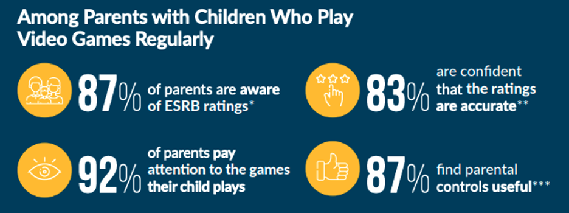

# Tempr
## Statement of Problem
Cyberbullying during multiplayer video game sessions leads to negative impacts in adolescents like lower self-esteem, poor grades, and poor relational patterns. Unfortunately, cyberbullying has been on the rise now more than ever due to COVID-19 drawing more kids to digital platforms for extended periods of time.




## Design Objectives
It would be valuable to create an inexpensive tool that recognizes anger levels and gently brings awareness to the user of their mental state. The tool would implement light color therapy in order to help the user cool down while verbally or visually suggesting they take a short break from the activity, or other feedback depending on context (gaming, driving, heated discussions among couples, childcare, etc.). 
## File purpose
| File | Purpose |
|:-----|:--------|
| speech.py | Hosts code to translate speech into text. Uses Google Speech-to-Text API |
| sentiment.py | Hosts code for sentiment analysis of the text |
| ifttt.py | Hosts code that triggers events through IFTTT |
| database.py | Hosts code that sends all the data to Azure SQL DB |
| query.sql | SQL file to query through our DB |
# Installation 
## Create Azure SQL Database
Follow this tutorial by [Microsoft](https://docs.microsoft.com/en-us/azure/azure-sql/database/single-database-create-quickstart?tabs=azure-portal).
## Install dependencies Mac/PC (testing purposes)
```
pip3 install vaderSentiment (for sentiment)
pip3 install SpeechRecognition (for speech-to-text)
pip3 install pyaudio (for audio)
pip3 install pyodbc (for DB connection)
```
Follow the following instructions to [Download ODBC Driver for SQL Server](https://docs.microsoft.com/en-us/sql/connect/odbc/download-odbc-driver-for-sql-server?view=sql-server-ver15)
## Run code on terminal/command line
```
python3 database.py
```
##  Raspberry PI 4 Setup
### For Speech & Sentiment
```
pip3 install SpeechRecognition
sudo apt-get install python-pyaudio python3-pyaudio
pip3 install pyaudio
sudo apt-get install flac
python -m speech_recognition (test mic)
```
### Connecting Raspberry Pi to Microsoft Azure with Python3
Follow the [tutorial](http://mdupont.com/Blog/Raspberry-Pi/azure-python3.html#Intro) with some steps modified. Double check against here before running any commands. 
#### Introduction
Run this instead:
```
sudo apt-get install python python-pip gcc g++ build-essential python-dev python3-dev python3-setuptools python3-pip
```
#### Azure SDK
Skip this step (don't need these libraries)
#### Create SQL Database
Skip this step if you already have created a database.