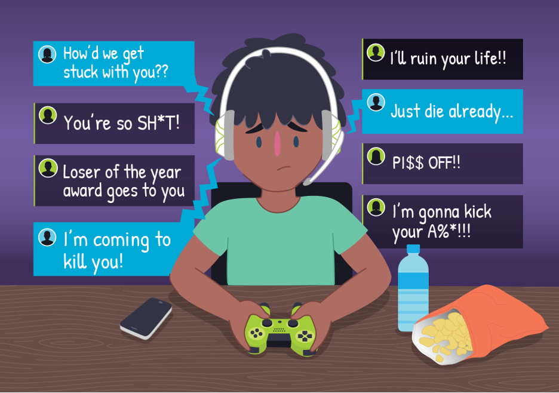

## Statement of Problem
Aggressive behavior triggered by stressful situations in which people have little to no control can be very difficult to mediate. Recurring aggressive behavior may have long-term consequences such as irritability, restlessness, and an impact on an individual’s mood and/or relationships.

COVID-19 forced people to search for available social outlets during times of lockdown and social distancing, allowing video game playing to hit all-time peaks in usage and popularity among family and friends. Where there are gamers, there is, naturally, an abundance of “toxic” gamers, who may show aggression towards teammates. Constant harassment from these toxic players can furthermore cause depression in others playing with them.



## Solution
Tempr functions as an awareness tool for both parents with young gamers and for early adolescents. The goal is to minimize verbal aggression and explicit language while helping children and parents recognize inappropriate behavior during gameplay.

The current implementation of Tempr measures how toxic a player is towards others and provides real-time feedback via smart home LEDs mounted behind a TV as well as a time management function that increases or decreases gaming time based on previous positive/negative behavior. Parents can also configure a list of bad words they don’t want their child(ren) saying and Tempr will track if the words are used, again providing real-time feedback and longer-term consequences.

The technology behind Tempr can be integrated to games for more feedback options such as providing players with in-game currency for positive behavior and putting a player on time-out for a set duration once they reach a certain threshold.

Ultimately, we hope to discourage children from expressing aggressive behavior towards other players (either through their own self-awareness or through parental oversight) and reduce toxicity in gaming environments.

While our primary focus group for this tool is gamers, there could be a much wider range of applications for Tempr. This solution could prove useful during serious arguments between couples and family members, and even help drivers become aware of road rage situations. This technology could further provide aggression awareness in elderly care facilities where residents have difficulty communicating, as well as child daycare’s and schools.

* [Youtube Video](https://youtu.be/QFAw6btepRQ)

## Functionality


# Hardware Requirements
* [Raspberry Pi 4](https://www.raspberrypi.org/products/raspberry-pi-4-model-b/)
* [ReSpeaker 4-Mic Array for Raspberry Pi](https://www.seeedstudio.com/ReSpeaker-4-Mic-Array-for-Raspberry-Pi.html)
* [Wyze Plug (2-Pack)](https://wyze.com/wyze-plug.html)
* [Z LED Strip 3.3’ Kit ("Z TV")](https://www.lifx.com/products/z-tv-led-strip)
* [Z LED Strip 3.3' (Extension)](https://www.lifx.com/products/lifx-z-extension)
* [IFTTT](https://ifttt.com/)

# Installation 
## Create Azure SQL Database
Follow this tutorial by [Microsoft](https://docs.microsoft.com/en-us/azure/azure-sql/database/single-database-create-quickstart?tabs=azure-portal).
## Install dependencies Mac/PC (testing purposes)
```
pip3 install vaderSentiment (for sentiment)
pip3 install SpeechRecognition (for speech-to-text)
pip3 install pyaudio (for audio)
pip3 install pyodbc (for DB connection)
```
Follow the following instructions to [Download ODBC Driver for SQL Server](https://docs.microsoft.com/en-us/sql/connect/odbc/download-odbc-driver-for-sql-server?view=sql-server-ver15)
## Run code on terminal/command line
```
python3 database.py
```
##  Raspberry PI 4 Setup
### For Speech & Sentiment
```
pip3 install SpeechRecognition
sudo apt-get install python-pyaudio python3-pyaudio
pip3 install pyaudio
sudo apt-get install flac
python -m speech_recognition (test mic)
```
### Connecting Raspberry Pi to Microsoft Azure with Python3
Follow the [tutorial](http://mdupont.com/Blog/Raspberry-Pi/azure-python3.html#Intro) with some steps modified. Double check against here before running any commands. 
#### Introduction
Run this instead:
```
sudo apt-get install python python-pip gcc g++ build-essential python-dev python3-dev python3-setuptools python3-pip
```
#### Azure SDK
Skip this step (don't need these libraries)
#### Create SQL Database
Skip this step if you already have created a database.
